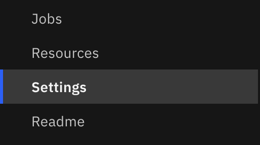
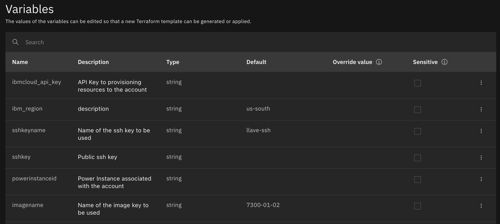
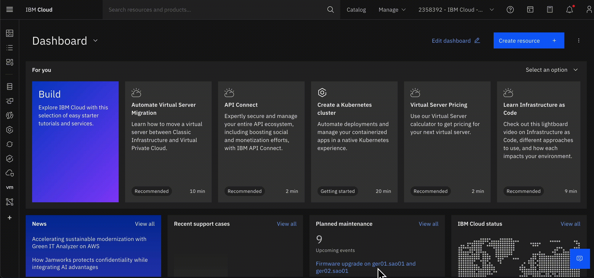
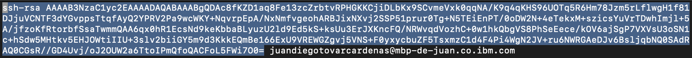
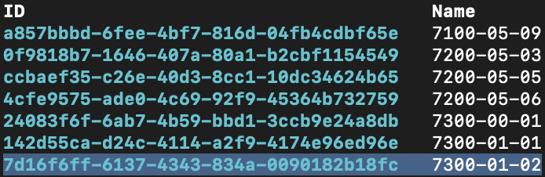
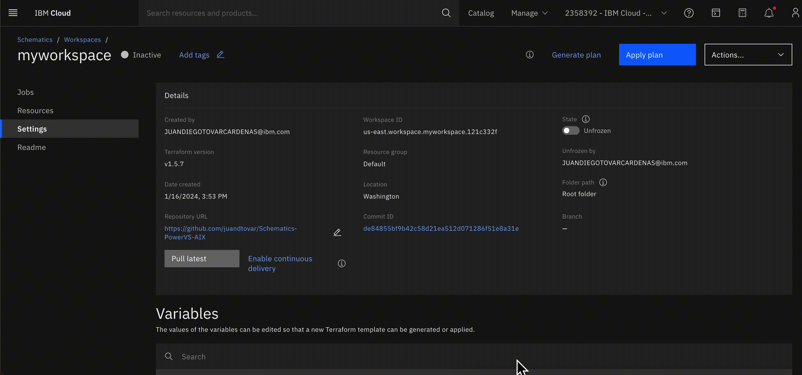

# PowerVS Schematics
_Este repositorio contiene el script para el despliegue de una instancia virtual Power en IBM Cloud_

## Índice
1. [Contenido](#contenido)
2. [Prerrequisitos](#prerrequisitos)
3. [Procedimiento](#procedimiento)
    - [Crear un espacio de trabajo para power en la nube](#crear-un-espacio-de-trabajo-para-power-en-la-nube)
    - [Crear un espacio de trabajo de Schematics](#crear-un-espacio-de-trabajo-de-schematics)
    - [Definir las variables](#definir-las-variables)
    - [Generar plan en Terraform](#generar-plan-en-terraform)
    - [Aplicar plan en Terraform](#aplicar-plan-en-terraform)
    - [Verificar la instancia de Power en IBM Cloud](#verificar-la-instancia-de-power-en-ibm-cloud)

## Contenido
1. Archivo principal de aprovisionamiento de recursos
2. Archivo de variables de IaC
3. Provider para confirmación de autorizaciones para el aprovisionamiento de recursos en IBM Cloud

## Prerrequisitos
Tener una cuenta en [IBM Cloud](https://cloud.ibm.com/) con un grupo de recursos disponible (puede ser el _Default_).

## Procedimiento

### Crear un espacio de trabajo para power en la nube.
Para ello diríjase a [IBM Cloud](https://cloud.ibm.com/) y entre en el apartado **Catalog** > **Compute** > **Workspace for Power Systems Virtual Server** > **Create a workspace**.


Llene las variables de la siguiente manera:
- **Location**
  - **Data Center**: Lugar físico donde estará la instancia Power.
- **Details**
  - **Name**: Ingrese un nombre para el espacio de trabajo.
  - **Resource group**: Seleccione el grupo de recursos en el cual desea tener el espacio de trabajo.
  - **User tags/Access management tags**: Etiquetas adicionales, son opcionales.
- **Integrations (Optional)**: Integraciones adicionales de IBM Cloud, se recomienda dejar por defecto.

Acepte términos y condiciones y dé **Create**, el aprovisionamiento se demora aproximadamente 1 minuto, se redirigirá a la lista de todos los espacios de trabajo que existen, busque el que acaba de crear y guarde la variable ```CRN``` que se usará más adelante.

### Crear un espacio de trabajo de Schematics
Para ello diríjase a IBM Cloud y entre en el apartado **Catalog** > **Developer tools** > **Schematics** > **Create a workspace**.


Llene las variables de la siguiente manera:
- **1. Specify template**
  - **GitHub, GitLab or Bitbucket repository URL**: El link de los recursos, es decir https://github.com/juandtovar/Schematics-PowerVS-AIX. Marque la opción **Use full repository**.
  - **Terraform version**: Versión de Terraform, en este caso se uso _terraform_v1.5_.
- **2. Workspace details**
  - **Workspace name**: Ingrese un nombre para el espacio de trabajo.
  - **Resource group**: Seleccione el grupo de recursos en el cual desea tener el espacio de trabajo.
  - **Location**: En qué lugar se van a ejecutar las acciones del espacio de trabajo, seleccione el mismo lugar del espacio de trabajo creado en la sección anterior.

Dé en **Create**, se abrirá el espacio de trabajo en la pestaña _Settings_ y empezará a cargas las variables necesarias para el despliegue, se demora aproximadamente 2 minutos.





En el botón **Pull latest** se actualiza el código fuente en caso de requerirlo.

### Definir las variables
Defina las siguientes variables de la siguiente manera:
- **ibm_region**: Región de despliegue, valor por defecto us-south.
- **sshkeyname**: Ingrese un nombre para la llave ssh.
- **instancename**: Ingrese un nombre para la instancia virtual de Power que se va a crear.
- **networkname**: Ingrese un nombre para la red que se va a crear.
- **cidr**: Dirección IP con prefijo en clase C Ej: 192.168.##.0/24. Puede dejar el valor por defecto.
- **memory**: Capacidad de memoria RAM en GB que se va a usar inicialmente, debe ser un valor entero mayor o igual a 2.
- **processors**: Capacidad de CPUs que se va a usar inicialmente, debe ser un multiplo entero de 0.25 Ej: 0.25, 0.5, 0.75, etc.

Las demás variables requieren procedimientos adicionales que se especifican a continuación:

**ibmcloud_api_key**

Ingrese al _Identity & Access Management_ para crear un api key, para ello entre al apartado **Manage** > **Access (IAM)** > **API Keys** > **Create**. Aquí cree un api key y descargue el archivo para futuros accesos (esta api key es valida para acceso de otros servicios) copie el valor del api key e ingréselo en la variable correspondiente del espacio de trabajo de Schematics marcando la casilla _Sensitive_, esta opción oculta el valor en cualquier entorno, esto es necesario ya que es un accesso directo a su cuenta de IBM Cloud.



**sshkey**

Para esta variable se requiere crear una llave SSH pública por medio de línea de comandos con el siguiente comando:
```
ssh-keygen -m PEM -t rsa -f "NOMBRE_DE_LA_LLAVE"
```
En NOMBRE_DE_LA_LLAVE ingrese un nombre para identificar su llave ssh, esto creara dos archivos con dos llaves, una privada y una pública en archivos del mismo nombre pero en el caso de la pública se obtiene la extensión .pub, en este se encuentra el valor de la llave pública que se necesita, acceda a él (puede usar el comando ```vi NOMBRE_DE_LA_LLAVE``` y volver a la terminal escribiendo ```:wq``` o usar un lector de archivos de su preferencia), copie el valor desde ```ssh-rsa``` hasta el siguiente espacio (no incluya el valor del usuario después de él, en la siguiente imagen se muestra un ejemplo) e ingréselo en la variable correspondiente del espacio de trabajo de Schematics. En el otro archivo generado (sin extensión .pub) se encuentra la llave privada, guárdela para futuros accesos.



**powerinstanceid**

La variable ```CRN``` guardada anteriormente contiene el valor del ID de nuestro espacio de trabajo en power y corresponde con el valor entre los 3 últimos puntos dobles, por ejemplo, si nuestro ```CRN``` es

_crn:v1:bluemix:public:power-iaas:dal10:a/736c7cd58317415b8d28a03e0e81eaf5:**88b056cc-c43d-43b5-8e76-a509fbd6aca2**::_

entonces nuestro ID es _88b056cc-c43d-43b5-8e76-a509fbd6aca2_, copie este valor e ingréselo en la variable correspondiente del espacio de trabajo de Schematics.

**imagename** e **imageid**

Estos valores dependen de la imagen que se quiera usar para la instancia, deben ser valores que correspondan a la misma imagen por lo que se debe verificar esta correspondencia de la siguiente manera:

En la terminal ingrese a su cuenta de IBM Cloud con un one-time code
```
ibmcloud login -sso
```
Ingrese con sus datos y copie el código que se genera en el navegador, este código no se verá al pegarlo en la terminal. Ahora debemos _apuntar_ al servicio de nuestro espacio de trabajo de power, para ello use el comando
```
ibmcloud pi service-target "CRN"
```
usando el ```CRN``` completo creado anteriormente, debe obtener una salida del estilo "Targeting service crn:v1:bluemix:public:power-iaas:dal10:a/736c7cd58317415b8d28a03e0e81eaf5:88b056cc-c43d-43b5-8e76-a509fbd6aca2::...". Ahora podemos obtener el catálogo de imágenes disponibles mediante el comando
```
ibmcloud pi image-list-catalog
```
se genera una lista con columnas _ID_, _Name_ y _Address_, busque en _Name_ el valor por defecto que hay en **imagename**, el valor que debe aparecer por defecto en **imageid** es el correspondiente en la columna _ID_, si no corresponde debe cambiarlo manualmente.



### Generar plan en Terraform
Ya están definidas todas la variables y se debe generar un plan de ejecución de Terraform, dé click en el botón **Generate Plan**, en la sección **Jobs** puede realizar un seguimiento de las acciones de Schematics, debe obtener tres mensajes en una misma pestaña de esta sección, el primero debe decir _Generate plan pending_, el segundo _Generate plan in progress_ y el tercero _Generate plan successfull_, en el botón **View cost estimate** puede obtener una estimación del costo del servicio.



La generación del plan se demora aproximadamente 2 minutos.


### Aplicar plan en Terraform
Una vez generado el plan se procede a aplicar el código de infraestructura en el botón **Apply plan**, nuevamente en la sección **Jobs** puede hacer seguimiento de las acciones de Schematics, debe obtener mensajes análogos a los que obtuvo en la sección anterior. La aplicación se demora aproximadamente 18 minutos. _**Solo hasta aplicar el plan se va a generar facturación**_.


### Verificar la instancia de Power en IBM Cloud
Vuelva a su espacio de trabajo de Power en IBM Cloud, seleccione el espacio de trabajo que creó y verifique en las siguientes secciones los siguientes parámetros:
- **Virtual server instances**: Debe aparecer la instancia de Power con el mismo **instancename** declarado anteriormente.
- **SSH keys**: La llave ssh usada con el mismo **sshkeyname** declarado anteriormente.
- **Boot images**: La imagen con la que se realizó el despliegue con el mismo **imagename** declarado anteriormente.
- **Networking** > **Subnets**: La subred usada con el mismo **networkname** declarado anteriormente.
- **Storage volumes**: Un almacenamiento _test-volume_ de 10 GB.

Con esto finaliza el despliegue.

Autores: IBM Cloud Tech Sales - Juan Diego Tovar Cárdenas.
